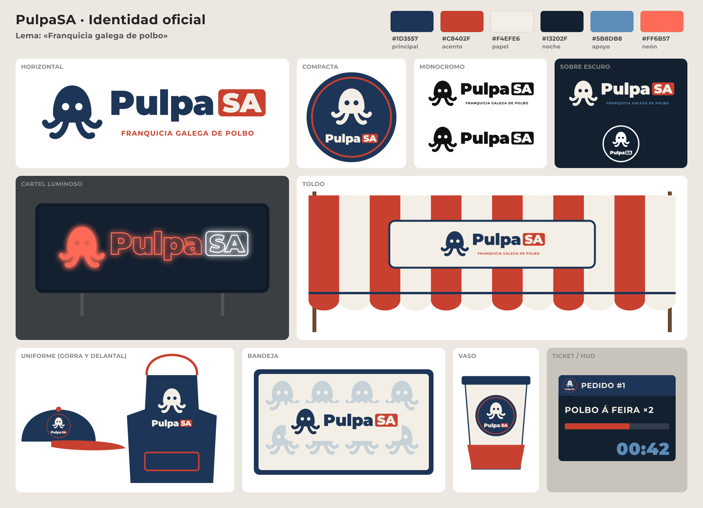

# Identidad de marca: PulpaSA

Marca ficticia del juego (D21). Sustituye al «McPULPO» de la imagen de referencia
(`docs/art/style-refs/referencia-elegida-2026-10-06.png`) en cartel, toldo, uniformes, envases y UI.
Ficha: PUL-088. **Estado: definitiva.** El responsable eligió la propuesta A «Mariña» con el lema
«Franquicia galega de polbo» (2026-10-06).



Azul marino gallego con rojo pimentón: marinera, seria, «de franquicia». Encaja con el toldo
actual del juego (rayas rojas y blancas), así que el cambio en escena es el menor.

## Reglas

- **Nombre**: siempre `PulpaSA`, en una palabra. «Pulpa» en Montserrat Black y «SA» en
  mayúsculas dentro de una **placa redondeada** de color pimentón (rasgo distintivo de la marca:
  parodia de «Sociedad Anónima», como una etiqueta de precio o de ticket).
- **Lema**: «Franquicia galega de polbo» (respuesta al «American octopus franchise» de la
  referencia), en versalitas de Montserrat Bold con tracking +8 %.
- **Símbolo**: pulpo redondo con ojos recortados y cuatro tentáculos rizados, sin contorno;
  heredero del logotipo histórico `godot/assets/textures/logo/PulpaSA.png`, que no se modifica.
- **Sin parecidos con marcas registradas**: nada de «Mc», ni arcos, ni amarillo. El pimentón va
  siempre con marino y papel, nunca con amarillo.
- **Idioma**: el lema y los textos de marca dentro del juego van en gallego (polbo, bandexa…).
- **Área de respeto**: alrededor del logotipo, como mínimo la altura de la placa «SA».
- **Tamaño mínimo**: horizontal, 120 px de ancho (sin lema por debajo de 240 px); compacta, 32 px
  (por debajo, solo el símbolo).
- **Sobre fondos con mucho detalle** (toldo a rayas, madera) el logotipo va sobre una placa de
  color «papel» con borde marino.

## Colores

| Rol | Hex | Uso |
|---|---|---|
| Principal (marino) | `#1D3557` | Símbolo, «Pulpa», delantal, gorra, bordes |
| Acento (pimentón) | `#C8402F` | Placa «SA», lema, rayas del toldo, visera |
| Papel | `#F4EFE6` | Fondos claros, rayas claras del toldo, vasos |
| Noche | `#13202F` | Fondo del cartel luminoso y del ticket/HUD |
| Apoyo | `#5B8DB8` | Patrón de la bandeja, cifras del HUD |
| Neón | `#FF6B57` | Tubo del cartel luminoso (con «SA» en blanco) |

## Versiones

| Versión | Uso | SVG fuente (`art/brand/`) | PNG para Godot (`godot/assets/textures/brand/`) |
|---|---|---|---|
| Horizontal | Cartel, toldo, bandeja, menú principal | `pulpasa_horizontal.svg` | `pulpasa_horizontal.png` (1024 px) |
| Compacta (insignia redonda) | Gorra, vaso, icono del ticket/HUD, favicon | `pulpasa_compacta.svg` | `pulpasa_compacta.png` (512 px) |
| Monocromo negro | Sellos, impresión, grabado en madera/metal | `pulpasa_mono_negro.svg` | `pulpasa_mono_negro.png` (1024 px) |
| Monocromo blanco | Sobre fondos oscuros, calcomanías, cartel apagado | `pulpasa_mono_blanco.svg` | `pulpasa_mono_blanco.png` (1024 px) |
| Símbolo | Patrones (papel de bandeja), iconos pequeños, partículas | `pulpasa_simbolo.svg` | `pulpasa_simbolo.png` (512 px) |

En monocromo, la placa «SA» se mantiene y las letras se recortan (se ve el fondo). La lámina
(`art/brand/lamina.svg`) es solo de referencia y no se importa en Godot.

## Usos

| Uso | Versión | Pautas |
|---|---|---|
| **Cartel luminoso** (sobre la carpa, sustituye al de «McPULPO») | Horizontal sin lema, en tubo de neón | Caja color «noche»; «Pulpa» y símbolo en neón `#FF6B57`, «SA» en blanco; halo emisivo (en Godot: material con `emission`). |
| **Toldo** | Horizontal con lema, sobre placa «papel» | Rayas anchas pimentón/papel con faldón festoneado y ribete marino; el logotipo nunca va directamente sobre las rayas. |
| **Uniforme: gorra** | Compacta | Copa marina, visera y botón pimentón; insignia en el frontal. |
| **Uniforme: delantal** | Símbolo + logotipo apilados | Delantal marino, cinta y bolsillo pimentón, logotipo en «papel». |
| **Bandejas** | Horizontal sin lema + patrón de símbolos | Marco marino, papel salvamanteles «papel» con el símbolo repetido al 30 % en color de apoyo. |
| **Vasos** | Compacta | Vaso «papel», tapa y borde marinos, banda inferior pimentón. |
| **Ticket / HUD** | Compacta como icono | Cabecera marina con la insignia; cuerpo «noche», barra de tiempo pimentón y cifras en color de apoyo. Textos en Montserrat. |

## Propuestas descartadas

Se presentaron otras dos propuestas que el responsable descartó; sus ficheros se borraron y solo
quedan las láminas como registro de la decisión:
**B «Romaría»** (morado y turquesa, Comfortaa, «Polbo de festa»,
`docs/evidence/PUL-088/lamina_b_romaria.png`) y **C «Caldeiro»** (verde mar y cobre, Inter,
«Sociedade anónima do polbo», `docs/evidence/PUL-088/lamina_c_caldeiro.png`). Comparativa:
`docs/evidence/PUL-088/propuestas_resumo.png`.

## Fuentes y licencias

El texto de los SVG está **convertido a trazados**: los ficheros no dependen de la fuente
instalada y la licencia OFL no se aplica al dibujo resultante (la OFL solo regula la fuente en
sí). Si la UI del juego usa Montserrat, el fichero de fuente y su `OFL.txt` se añaden a
`godot/assets/fonts/` en otra ficha.

Fila para `docs/assets/licenses.md` (la añade el coordinador):

| Asset (origen) | Destino en `godot/` | Licencia | Atribución requerida |
|---|---|---|---|
| Montserrat Black y Bold (Julieta Ulanovsky y colaboradores; github.com/JulietaUla/Montserrat), convertidas a trazados en `art/brand/*.svg` (PUL-088) | `assets/textures/brand/pulpasa_*.png` | SIL OFL 1.1 | No en el dibujo; si se distribuye la fuente, incluir `OFL.txt` |
| Símbolo, placas y maquetas de `art/brand/` (PUL-088) | `assets/textures/brand/pulpasa_*.png` | Propio (equipo Pulpasa) | No |

Herramientas (no se distribuyen): fontTools y uharfbuzz (MIT/Apache) para convertir texto a
trazados; ImageMagick con librsvg para rasterizar.

## Regenerar

```sh
uv run --with fonttools --with uharfbuzz python art/brand/build_brand.py
```

Escribe los SVG en `art/brand/`, los PNG en `godot/assets/textures/brand/` y la lámina en
`docs/evidence/PUL-088/lamina_oficial.png`. La ruta de Montserrat (Fedora) está en `FONTS`.
