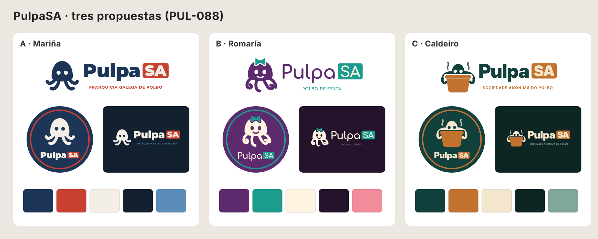
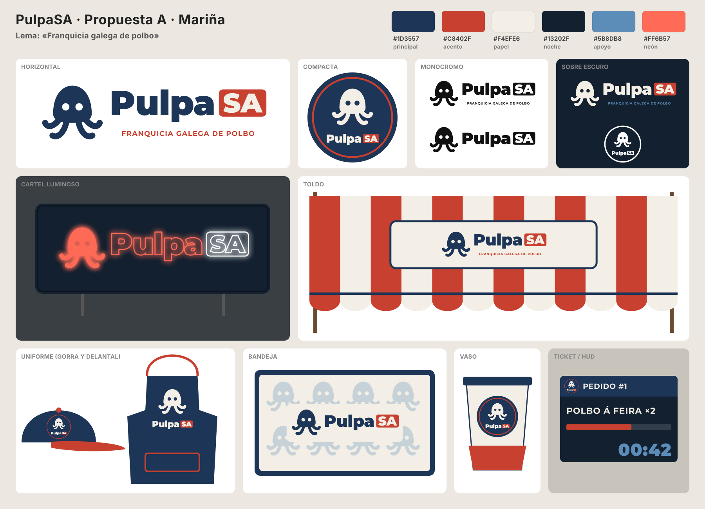
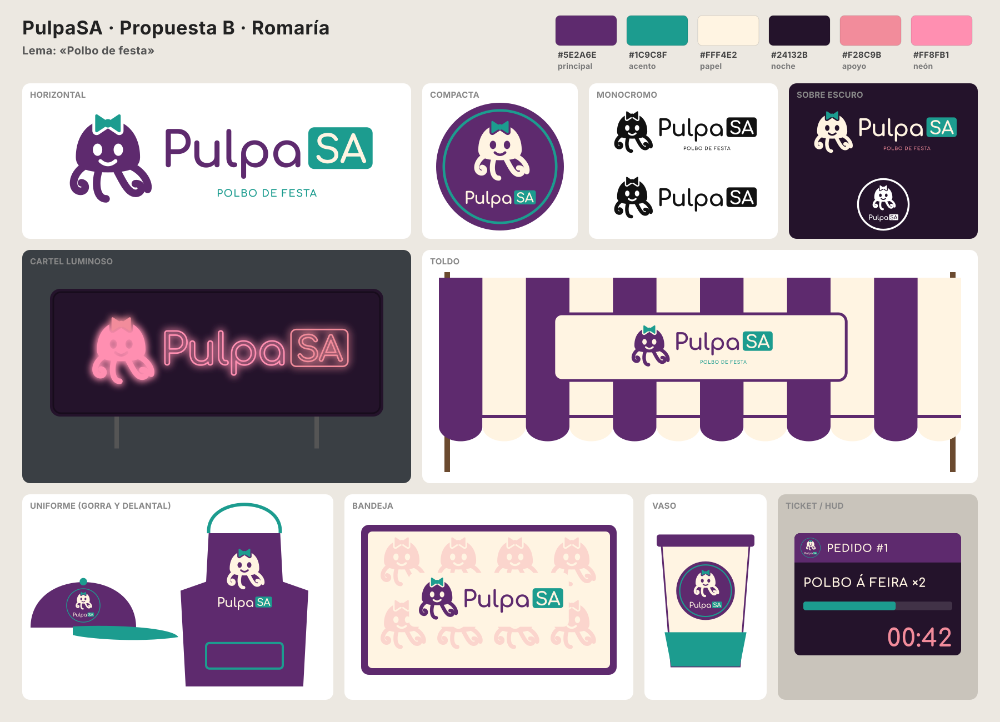
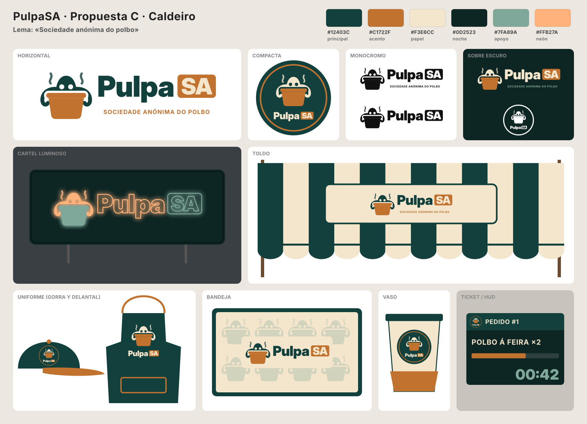

# Identidad de marca: PulpaSA

Marca ficticia del juego (D21). Sustituye al «McPULPO» de la imagen de referencia
(`docs/art/style-refs/referencia-elegida-2026-10-06.png`) en cartel, toldo, uniformes, envases y UI.
Ficha: PUL-088. **Estado: tres propuestas pendientes de elección del responsable.**



## Reglas comunes a las tres propuestas

- **Nombre**: siempre `PulpaSA`, en una palabra. «Pulpa» en la tipografía de la marca y «SA» en
  mayúsculas dentro de una **placa redondeada** de color de acento (rasgo distintivo de la marca:
  parodia de «Sociedad Anónima», como una etiqueta de precio o de ticket).
- **Símbolo**: un pulpo sencillo y redondo (con ojos recortados, sin contorno), heredero del
  logotipo histórico `godot/assets/textures/logo/PulpaSA.png`, que no se modifica.
- **Sin parecidos con marcas registradas**: nada de «Mc», ni arcos, ni la pareja rojo + amarillo
  de la referencia. Ninguna propuesta usa amarillo.
- **Idioma**: los lemas y los textos de marca dentro del juego van en gallego (polbo, bandexa…).
- **Área de respeto**: alrededor del logotipo, como mínimo la altura de la placa «SA».
- **Tamaño mínimo**: horizontal, 120 px de ancho (sin lema por debajo de 240 px); compacta, 32 px
  (por debajo, solo el símbolo).
- **Sobre fondos con mucho detalle** (toldo a rayas, madera) el logotipo va sobre una placa de
  color «papel» con borde del color principal.

## Versiones (en las tres propuestas)

| Versión | Uso | Fichero SVG (`art/brand/propuesta_<x>/`) | PNG para Godot (`godot/assets/textures/brand/propuesta_<x>/`) |
|---|---|---|---|
| Horizontal | Cartel, toldo, bandeja, menú principal | `pulpasa_<x>_horizontal.svg` | `pulpasa_<x>_horizontal.png` (1024 px) |
| Compacta (insignia redonda) | Gorra, vaso, icono del ticket/HUD, favicon | `pulpasa_<x>_compacta.svg` | `pulpasa_<x>_compacta.png` (512 px) |
| Monocromo negro | Sellos, impresión, grabado en madera/metal | `pulpasa_<x>_mono_negro.svg` | `pulpasa_<x>_mono_negro.png` |
| Monocromo blanco | Sobre fondos oscuros, calcomanías, cartel apagado | `pulpasa_<x>_mono_blanco.svg` | `pulpasa_<x>_mono_blanco.png` |
| Símbolo | Patrones (papel de bandeja), iconos pequeños, partículas | `pulpasa_<x>_simbolo.svg` | `pulpasa_<x>_simbolo.png` (512 px) |

En monocromo, la placa «SA» se mantiene y las letras se recortan (se ve el fondo).

## Propuesta A · Mariña



Azul marino gallego con rojo pimentón: marinera, seria, «de franquicia». La que más se parece al
toldo actual del juego (rayas rojas y blancas), así que el cambio en escena es el menor.

- **Lema**: «Franquicia galega de polbo» (respuesta directa al «American octopus franchise»).
- **Tipografía**: Montserrat Black (logotipo) y Montserrat Bold (lema y textos), tracking −1 %.
- **Símbolo**: pulpo redondo con cuatro tentáculos rizados.

| Rol | Hex | Uso |
|---|---|---|
| Principal | `#1D3557` | Símbolo, «Pulpa», delantal, gorra, bordes |
| Acento (pimentón) | `#C8402F` | Placa «SA», lema, rayas del toldo, visera |
| Papel | `#F4EFE6` | Fondos claros, rayas claras del toldo, vasos |
| Noche | `#13202F` | Fondo del cartel luminoso y del ticket/HUD |
| Apoyo | `#5B8DB8` | Patrón de la bandeja, cifras del HUD |
| Neón | `#FF6B57` | Tubo del cartel luminoso (con «SA» en blanco) |

## Propuesta B · Romaría



Morado «pulpo» con turquesa y rosa: la más festiva e infantil, encaja con el tono cómico del
juego cooperativo y con las guirnaldas de la feria.

- **Lema**: «Polbo de festa».
- **Tipografía**: Comfortaa Bold (logotipo, lema y textos), tracking −2 %.
- **Símbolo**: pulpo sonriente con lazo de romería y tentáculos en espiral.

| Rol | Hex | Uso |
|---|---|---|
| Principal | `#5E2A6E` | Símbolo, «Pulpa», delantal, gorra, rayas del toldo |
| Acento (turquesa) | `#1C9C8F` | Placa «SA», lazo, lema, visera |
| Papel | `#FFF4E2` | Fondos claros, rayas claras, vasos |
| Noche | `#24132B` | Cartel luminoso, ticket/HUD |
| Apoyo (rosa) | `#F28C9B` | Patrón de la bandeja, cifras del HUD |
| Neón | `#FF8FB1` | Tubo del cartel (con «SA» en rosa de apoyo) |

## Propuesta C · Caldeiro



Verde mar oscuro con cobre: el caldero de cobre del pulpo á feira es el símbolo. Más artesanal y
«de feria de verdad»; el lema juega con la «SA».

- **Lema**: «Sociedade anónima do polbo».
- **Tipografía**: Inter Display Black (logotipo) e Inter Bold (lema y textos), tracking −2 %.
- **Símbolo**: pulpo asomando de un caldero de cobre humeante, con los tentáculos por fuera.

| Rol | Hex | Uso |
|---|---|---|
| Principal | `#12403C` | Símbolo, «Pulpa», delantal, gorra, rayas del toldo |
| Acento (cobre) | `#C1722F` | Placa «SA», caldero, lema, visera |
| Papel | `#F3E6CC` | Fondos claros, rayas claras, vasos |
| Noche | `#0D2523` | Cartel luminoso, ticket/HUD |
| Apoyo | `#7FA89A` | Patrón de la bandeja, cifras del HUD |
| Neón | `#FFB27A` | Tubo del cartel (con «SA» y caldero en verde de apoyo) |

## Usos

Cada lámina muestra los mismos usos; las pautas valen para la propuesta que se elija.

| Uso | Versión | Pautas |
|---|---|---|
| **Cartel luminoso** (sobre la carpa, sustituye al de «McPULPO») | Horizontal sin lema, en tubo de neón | Caja color «noche»; «Pulpa» y símbolo en color neón, «SA» en el segundo tono; halo emisivo (en Godot: material con `emission`). |
| **Toldo** | Horizontal con lema, sobre placa «papel» | Rayas anchas «principal»/«papel» (A: acento/papel) con faldón festoneado; el logotipo nunca va directamente sobre las rayas. |
| **Uniforme: gorra** | Compacta | Copa del color principal, visera y botón de acento; insignia en el frontal. |
| **Uniforme: delantal** | Símbolo + logotipo apilados | Delantal del color principal, cinta y bolsillo de acento, logotipo en «papel». |
| **Bandejas** | Horizontal sin lema + patrón de símbolos | Marco del color principal, papel salvamanteles «papel» con el símbolo repetido al 30 % en color de apoyo. |
| **Vasos** | Compacta | Vaso «papel», tapa y borde del color principal, banda inferior de acento. |
| **Ticket / HUD** | Compacta como icono | Cabecera del color principal con la insignia; cuerpo «noche», barra de tiempo de acento y cifras en color de apoyo. Textos en la tipografía de la marca. |

## Fuentes y licencias

El texto de los SVG está **convertido a trazados**: los ficheros no dependen de las fuentes
instaladas y la licencia OFL no se aplica al dibujo resultante (la OFL solo regula la fuente en
sí). Si la UI del juego usa la tipografía de la propuesta elegida, el fichero de fuente y su
`OFL.txt` se añaden a `godot/assets/fonts/` en otra ficha.

| Recurso | Usado en | Licencia | Autor / origen |
|---|---|---|---|
| Montserrat Black y Bold | Propuesta A | SIL OFL 1.1 | Julieta Ulanovsky y colaboradores (paquete `julietaula-montserrat-fonts` de Fedora; github.com/JulietaUla/Montserrat) |
| Comfortaa Bold | Propuesta B | SIL OFL 1.1 | Johan Aakerlund (paquete `aajohan-comfortaa-fonts`; github.com/googlefonts/comfortaa) |
| Inter Display Black, Inter Bold | Propuesta C y rótulos de las láminas | SIL OFL 1.1 | Rasmus Andersson (paquete `rsms-inter-fonts`; github.com/rsms/inter) |
| Símbolos, placas y maquetas | Todo | Propio (equipo Pulpasa) | Dibujados a mano en SVG por `art/brand/build_brand.py` |
| Logotipo histórico `PulpaSA.png` | Solo como referencia de la idea pulpo + P | Propio (prototipo) | Sin cambios |

Herramientas (no se distribuyen): fontTools y uharfbuzz (MIT/Apache) para convertir texto a
trazados; ImageMagick con librsvg para rasterizar.

## Regenerar

```sh
uv run --with fonttools --with uharfbuzz python art/brand/build_brand.py
```

Escribe los SVG en `art/brand/`, los PNG en `godot/assets/textures/brand/` y las láminas en
`docs/evidence/PUL-088/`. Las rutas de las fuentes (Fedora) están en `FONTS`. Tras elegir
propuesta, se pueden borrar las otras dos carpetas de SVG y PNG (con sus `.import`).
