# Biblioteca de materiales v2

Autor: PUL-074 (asset-pipeline), 2026-10-07. Implementa [`art-bible.md`](art-bible.md) v2 §3 (catálogo,
qué se permite) y §4.2 (texturas); si algo choca, manda la biblia. Flujo de export en
[`pipeline.md`](pipeline.md) §8.

## 1. Dónde está cada cosa

| Pieza | Ruta | Qué es |
|---|---|---|
| Biblioteca Blender | `art/blender/_materials_v2.blend` | 45 materiales `mat_*` con *fake user* y la escena `lamina` (esfera + cubo por material) |
| Plantilla | `art/blender/_template.blend` | **Enlaza** (link, ruta relativa `//_materials_v2.blend`) los 45 materiales; tira de muestras `ref_materials_v2` en la colección `reference`. Ya no trae los 32 colores planos de la v1 |
| Texturas | `godot/assets/textures/v2/<textura>/<textura>_{albedo,orm,normal}.png` | Las usan a la vez el `.blend` (ruta relativa, no empaquetadas) y los `.tres` |
| Materiales Godot | `godot/assets/materials/v2/mat_*.tres` | `StandardMaterial3D` equivalentes, para escenas, decals y sustituciones |
| Fuente | `godot/assets/textures/v2/_src/` (con `.gdignore`) | `gen_materials_v2.py` (texturas, `.tres` y manifiesto `materials_v2.json`) y `build_materials_v2_blend.py` (el `.blend`). Copia de ambos como Text dentro del `.blend` |
| Asset de prueba | `godot/assets/models/_pipeline/materials_v2_test/` | Taburete con `mat_steel_brushed`, `mat_plastic_red` y `mat_wood_used` (AC2) |
| Evidencia | [`docs/evidence/PUL-074/`](../evidence/PUL-074/) | Láminas Blender/Godot, antes/después de `level_01`, muestras |

Regenerar todo (determinista, semillas fijas), desde la raíz:

```sh
python3 godot/assets/textures/v2/_src/gen_materials_v2.py            # PNG + .tres + manifiesto
blender -b --factory-startup --python godot/assets/textures/v2/_src/build_materials_v2_blend.py \
    -- --render docs/evidence/PUL-074/blender_lamina.png                # .blend + lámina
godot --headless --path godot --import
```

Si se regeneran los PNG, los `.png.import` se conservan (VRAM, mipmaps; ver §4). La plantilla no hay
que tocarla: enlaza por nombre.

## 2. Convenciones

- **Densidad**: 1 unidad de UV = **2 m**. Una textura de 512² da **256 px/m** (art-bible §4.2). Al
  desplegar un asset, escala sus UV a esa densidad (en Blender: proyección de caja con las
  coordenadas en metros / 2; `tools/blender_export.py` tiene `box_uv()` de referencia). Excepción:
  `mat_ground_dirt` es 1024² y cubre **4 m** (1 UV = 4 m en la malla del suelo).
- **Mapas**: `_albedo` en sRGB; `_orm` lineal con R = oclusión (1, el AO va en el atlas de cada asset),
  **G = roughness**, **B = metallic**; `_normal` OpenGL (+Y), como glTF y Godot. Normales solo en
  materiales con relieve grande (trama, juntas, vetas, piedrecitas), nunca microdetalle.
- **Factores**: roughness y metallic finales = factor del material × canal del ORM (el ORM guarda la
  variación relativa, ≤ 1). Las texturas **neutras** (`steel_brushed*`, `plastic`, `wood_*`, `canvas`,
  `cloth`) son grises de media lineal 0,8 y el material les da el color con el factor
  (`baseColorFactor` / `albedo_color`), así una textura sirve para varias variantes. Las **propias**
  (`paint_*`, `burlap`, `cardboard`, `clay`, `granite`, `ground_dirt`, `grass`, `foliage`, `burnt_*`) ya
  llevan el color y su factor es blanco.
- **Color medio**: el generador ajusta cada textura para que el color medio (lo que se ve a distancia
  con mipmaps) quede en el hex de §2. Columna «media» del catálogo: los dos únicos desvíos son
  `mat_canvas_paper` y `mat_cloth_shirt` (blancos: el factor no puede pasar de 1), dentro del ≤ 10 %.
- **Ruido**: nada más fino de 4 px a 1080p (≈ 13 texels a 256 px/m) en superficies jugables; las
  vetas del acero miden ≥ 10 px y tienen contraste bajo; los arañazos del tablero (3 px) quedan en
  ≤ 1,1:1. Comida sin textura salvo el quemado (grietas grandes). Sin fotos ni texturas de terceros:
  todo es procedural y propio.
- **Variantes**: un color nuevo de una textura neutra (p. ej. ropa de comensal) se añade a `MATERIALS`
  del generador como `mat_<familia>_<variante>` y se regenera; no se crean materiales a mano.
- **Lo que no está aquí** (por diseño): desconchado de aristas con máscara de curvatura, AO, etiquetas,
  tornillos, logos, ventosas y el patrón del papel de bandeja van en el **atlas propio de cada asset**
  (art-bible §3.3); rodadas, charcos (`ground_puddle`, roughness 0,1) y manchas, como **decal** (§5 Z0).

## 3. Catálogo

Muestra: render Cycles del `.blend` con luz neutra (esfera r = 0,45 m y cubo de 0,8 m a la densidad
de §2). «Hex → media»: hex de la biblia y color medio de la textura × factor (desvío de luminancia).
Lámina completa: [Blender](../evidence/PUL-074/blender_lamina.png) ·
[Godot](../evidence/PUL-074/godot_lamina.png).

| Muestra | Material | Hex → media (ΔL) | Rough. / metal. | Textura (mapas) | Uso |
|---|---|---|---|---|---|
| 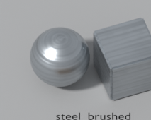 | `mat_steel_brushed` | `#B9BEC2` → `#B9BEC2` (0.0 %) | 0.40 / 1.0 | `steel_brushed` (512²: albedo + orm + normal) | Cocedores, tapas, frentes de cajón (`steel_light`) |
| 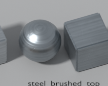 | `mat_steel_brushed_top` | `#9EA5AA` → `#9EA5AA` (0.0 %) | 0.42 / 1.0 | `steel_brushed_top` (512²: albedo + orm + normal) | **Tablero de encimera** (`steel_top`), con arañazos finos; solo en tableros |
| 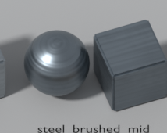 | `mat_steel_brushed_mid` | `#7D868D` → `#7D868D` (0.0 %) | 0.45 / 1.0 | `steel_brushed` (512²: albedo + orm + normal) | Frentes, patas y baldas de encimera (`steel_mid`) |
| 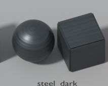 | `mat_steel_dark` | `#4E5458` → `#4E5458` (0.0 %) | 0.50 / 0.8 | `steel_brushed` (512²: albedo + orm + normal) | Cuerpo de kiosco, rejillas (`steel_dark`; `grate_dark` usa este) |
| 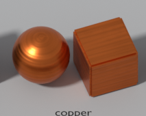 | `mat_copper` | `#C8672E` → `#C8672E` (0.0 %) | 0.40 / 1.0 | `steel_brushed` (512²: albedo + orm + normal) | Solo atrezo de fondo (cazos colgados), §3.1 |
| 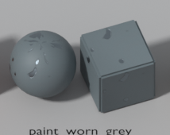 | `mat_paint_worn_grey` | `#5F6A6E` → `#5F6A6E` (0.0 %) | 0.60 / 1.0 | `paint_grey` (512²: albedo + orm + normal) | Postes, marcos, valla (`paint_grey`); desconcha a `steel_mid` |
| 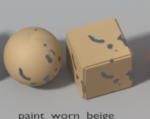 | `mat_paint_worn_beige` | `#B29770` → `#B29770` (0.0 %) | 0.60 / 1.0 | `paint_beige` (512²: albedo + orm + normal) | Generador, cajas eléctricas (`paint_beige`) |
| 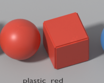 | `mat_plastic_red` | `#C8402F` → `#C8402F` (0.0 %) | 0.45 / 0.0 | `plastic` (512²: albedo + orm) | **Bandejas**, tapas de tanque (= `brand_red`) |
| 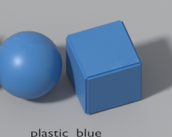 | `mat_plastic_blue` | `#3E78B0` → `#3E78B0` (0.0 %) | 0.45 / 0.0 | `plastic` (512²: albedo + orm) | Tanque de pulpos, bombona azul |
| 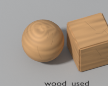 | `mat_wood_used` | `#B58A5C` → `#B58A5C` (0.0 %) | 0.70 / 0.0 | `wood_used` (512²: albedo + orm + normal) | Tablas de corte (con cortes), cajas de fruta, bancos |
| 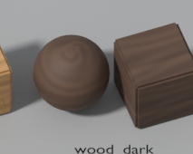 | `mat_wood_dark` | `#553E30` → `#553E30` (0.0 %) | 0.70 / 0.0 | `wood_dark` (512²: albedo + orm + normal) | Barriles, vigas, mangos |
| 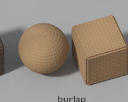 | `mat_burlap` | `#9C7D59` → `#9C7D59` (0.0 %) | 0.90 / 0.0 | `burlap` (512²: albedo + orm + normal) | Sacos de patatas (hilo de 16 px ≈ 6 cm) |
| 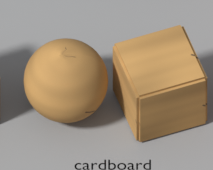 | `mat_cardboard` | `#B8935F` → `#B8935F` (0.0 %) | 0.85 / 0.0 | `cardboard` (512²: albedo + orm) | Cajas de cartón (cinta y garabatos sin texto) |
| 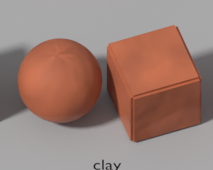 | `mat_clay` | `#A85A3A` → `#A85A3A` (0.0 %) | 0.75 / 0.0 | `clay` (512²: albedo + orm + normal) | Cuncas, jarras y cuencos (vidriado parcial) |
| 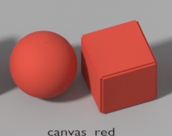 | `mat_canvas_red` | `#C8402F` → `#C8402F` (0.0 %) | 0.85 / 0.0 | `canvas` (512²: albedo + orm + normal) | Rayas rojas del toldo (`canvas_red`) |
| 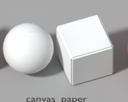 | `mat_canvas_paper` | `#F4EFE6` → `#E7E7E6` (7.8 %) | 0.85 / 0.0 | `canvas` (512²: albedo + orm + normal) | Rayas claras del toldo (`brand_paper`) |
| 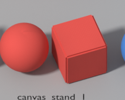 | `mat_canvas_stand_1` | `#D2473F` → `#D2473F` (0.0 %) | 0.85 / 0.0 | `canvas` (512²: albedo + orm + normal) | Toldillo del puesto 1 |
| 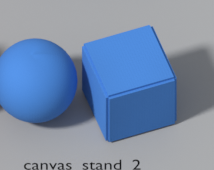 | `mat_canvas_stand_2` | `#3F7CC8` → `#3F7CC8` (0.0 %) | 0.85 / 0.0 | `canvas` (512²: albedo + orm + normal) | Toldillo del puesto 2 |
| 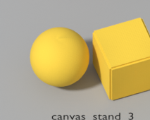 | `mat_canvas_stand_3` | `#E8C23A` → `#E7C23A` (0.3 %) | 0.85 / 0.0 | `canvas` (512²: albedo + orm + normal) | Toldillo del puesto 3 |
| 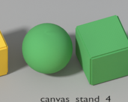 | `mat_canvas_stand_4` | `#4FA05A` → `#4FA05A` (0.0 %) | 0.85 / 0.0 | `canvas` (512²: albedo + orm + normal) | Toldillo del puesto 4 |
| 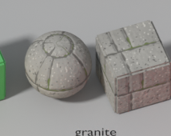 | `mat_granite` | `#8C8A84` → `#8C8A84` (0.0 %) | 0.85 / 0.0 | `granite` (512²: albedo + orm + normal) | Muro de sillares (Z3); musgo en juntas bajas |
| 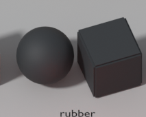 | `mat_rubber` | `#24272A` → `#24272A` (0.0 %) | 0.70 / 0.0 | — | Cables, mangueras de agua, neumáticos (liso) |
| 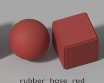 | `mat_rubber_hose_red` | `#8E2F2A` → `#8E2F2A` (0.0 %) | 0.70 / 0.0 | — | Manguera de gas roja (liso) |
| 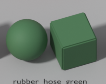 | `mat_rubber_hose_green` | `#3F6B45` → `#3F6B45` (0.0 %) | 0.70 / 0.0 | — | Manguera de gas verde (liso) |
| 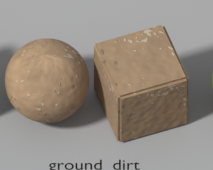 | `mat_ground_dirt` | `#A18668` → `#A18668` (0.0 %) | 0.95 / 0.0 | `ground_dirt` (1024²: albedo + orm + normal) | Suelo de tierra (Z0). **1 UV = 4 m**. Rodadas y charcos, como decal |
| 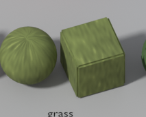 | `mat_grass` | `#66713C` → `#66713C` (0.0 %) | 0.90 / 0.0 | `grass` (512²: albedo + orm) | Hierba fuera de la zona jugable |
| 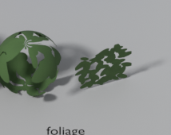 | `mat_foliage` | `#3E5A2E` → `#3E592E` (1.2 %) | 0.90 / 0.0 | `foliage` (512²: albedo + orm) | Tarjetas de hojas con alfa (scissor, doble cara): helechos y copas (Z3) |
| 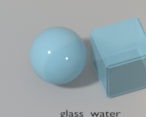 | `mat_glass_water` | `#8FC6D8` → `#8FC6D8` (0.0 %) | 0.05 / 0.0 | — | Agua del tanque (alfa 0,55, blend) |
| 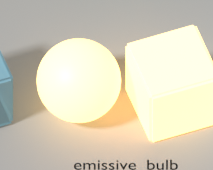 | `mat_emissive_bulb` | `#FFD58A` → `#FFD58A` (0.0 %) | 0.50 / 0.0 | — | Bombillas (emisivo 2,0) |
| 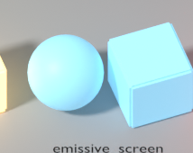 | `mat_emissive_screen` | `#8FD3F0` → `#8FD3F0` (0.0 %) | 0.50 / 0.0 | — | Pantalla del TPV (emisivo 0,6) |
| 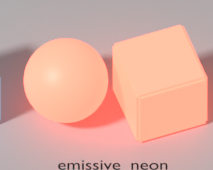 | `mat_emissive_neon` | `#FF6B57` → `#FF6B57` (0.0 %) | 0.50 / 0.0 | — | Tubo del cartel luminoso (emisivo 2,5) |
| 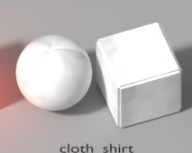 | `mat_cloth_shirt` | `#F2F0EC` → `#E7E7E7` (8.3 %) | 0.90 / 0.0 | `cloth` (512²: albedo + orm + normal) | Camiseta del uniforme |
| 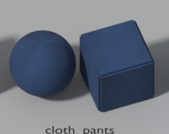 | `mat_cloth_pants` | `#1D3557` → `#1D3557` (0.0 %) | 0.90 / 0.0 | `cloth` (512²: albedo + orm + normal) | Pantalón, cinta del delantal, ribetes (`brand_navy`) |
| 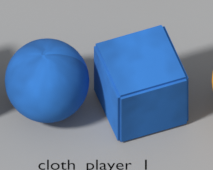 | `mat_cloth_player_1` | `#2F6FB5` → `#2F6FB5` (0.0 %) | 0.90 / 0.0 | `cloth` (512²: albedo + orm + normal) | Gorra y peto de J1 |
| 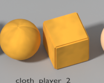 | `mat_cloth_player_2` | `#E0A02E` → `#E0A02E` (0.0 %) | 0.90 / 0.0 | `cloth` (512²: albedo + orm + normal) | Gorra y peto de J2 |
| 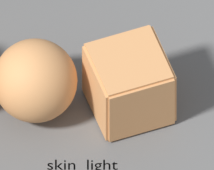 | `mat_skin_light` | `#EBC49A` → `#EBC49A` (0.0 %) | 0.70 / 0.0 | — | Piel, tono claro de la v1 |
| 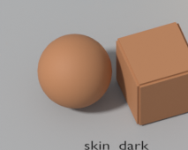 | `mat_skin_dark` | `#A8734D` → `#A8734D` (0.0 %) | 0.70 / 0.0 | — | Piel, tono oscuro de la v1 |
| 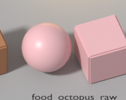 | `mat_food_octopus_raw` | `#E0AFB2` → `#E0AFB2` (0.0 %) | 0.40 / 0.0 | — | Pulpo crudo (húmedo, 0,4); ventosas en el atlas |
| 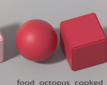 | `mat_food_octopus_cooked` | `#B8283D` → `#B8283D` (0.0 %) | 0.50 / 0.0 | — | Pulpo cocido (satinado, 0,5) |
| 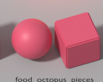 | `mat_food_octopus_pieces` | `#D4506A` → `#D4506A` (0.0 %) | 0.50 / 0.0 | — | Rodajas; el corte `#F4C6CC` va en el atlas |
| 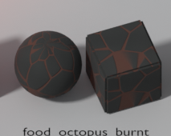 | `mat_food_octopus_burnt` | `#2A2320` → `#2A2320` (0.0 %) | 0.95 / 0.0 | `burnt_octopus` (512²: albedo + orm + normal) | Pulpo quemado: carbón con grietas grandes de brasa |
| 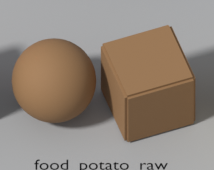 | `mat_food_potato_raw` | `#8E6B47` → `#8E6B47` (0.0 %) | 0.80 / 0.0 | — | Patata cruda |
| 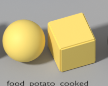 | `mat_food_potato_cooked` | `#F2D56B` → `#F2D56B` (0.0 %) | 0.60 / 0.0 | — | Cachelo cocido; el borde `#D8A93C` va en el atlas o la malla |
| 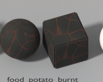 | `mat_food_potato_burnt` | `#2E2620` → `#2E2620` (0.0 %) | 0.95 / 0.0 | `burnt_potato` (512²: albedo + orm + normal) | Cachelo quemado (grietas grandes) |
| 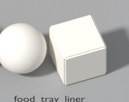 | `mat_food_tray_liner` | `#F4EFE6` → `#F4EFE6` (0.0 %) | 0.80 / 0.0 | — | Papel de bandeja liso; el patrón de símbolos al 15 % es del atlas de PUL-077 |

Texturas: 18 conjuntos (17 de 512² y el suelo de 1024²), 50 PNG, ≈ 3,2 MB en disco. En VRAM (BPTC/S3TC
con mipmaps, ≈ 1 byte/px) la biblioteca entera son ≈ 20 MB, muy por debajo de los 256 MB del nivel (§4.2).

## 4. En Godot

- Los `.tres` usan `albedo_texture`, `roughness_texture` (canal G), `metallic_texture` (canal B) y
  `normal_texture` del mismo juego, con `texture_filter` lineal + mipmaps + anisotropía. Para usarlos
  sobre una malla sin UV a la densidad v2 (primitivas, mallas v1), duplica el material y activa
  `uv1_triplanar` + `uv1_world_triplanar` con `uv1_scale = 1/2` (1/4 en el suelo): así lo hace la
  lámina de Godot.
- Import de los PNG (`.png.import`): `compress/mode=2` (VRAM), `mipmaps/generate=true`,
  `detect_3d/compress_to=0`; los `_normal` con `compress/normal_map=1`.
- Assets `.glb`: llevan las texturas **embebidas** y Godot las extrae junto al `.glb` al importar
  (`gltf/embedded_image_handling=1`; el test exige materiales embebidos). Decidido así (art-bible §3.3)
  porque cada `.glb` queda autocontenido y el atlas propio del asset sigue el mismo camino. Ver
  [`pipeline.md`](pipeline.md) §8.
- Resaltado: el contorno de `highlight_outline` se ve sobre todos los materiales claros
  (lámina de Godot, última fila); sobre `mat_canvas_paper` contrasta menos (amarillo sobre papel),
  pero ese material solo va en el toldo (Z3), que no se resalta.
