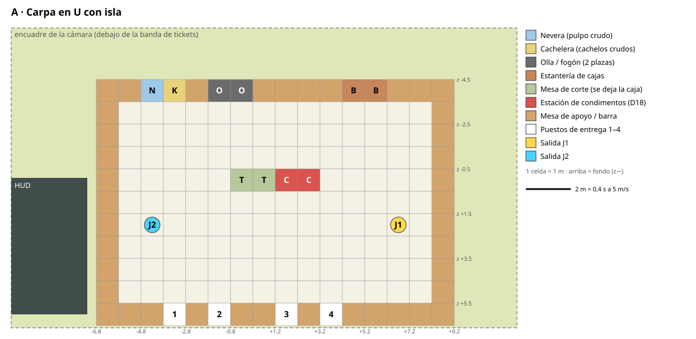
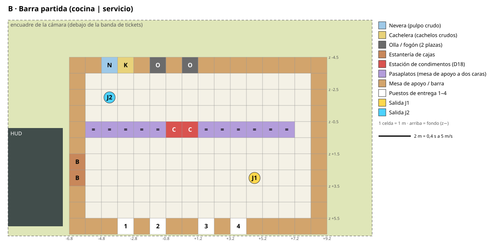
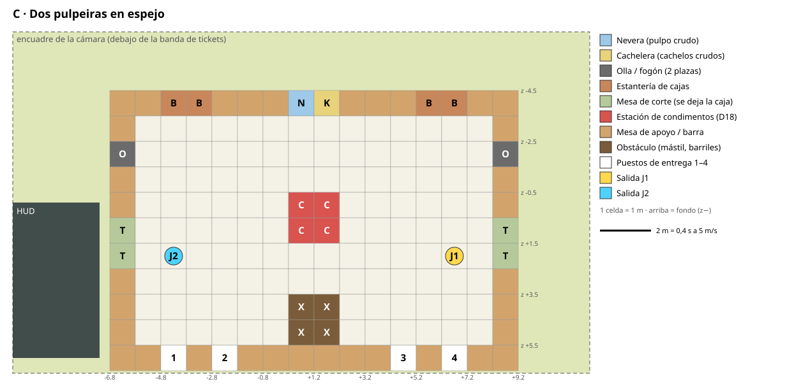

# Distribuciones de la cocina de `level_01` (D19, PUL-041; D23, PUL-092)

**Estado:** elegida la **planta B · barra partida** (D19, 2026-10-05), **modificada por D23**
(2026-10-07): hueco de la barra a x ≈ 3,2, 6 pasaplatos marcados y línea de condimentos «al paso»
sin bandeja. La sección siguiente es la planta vigente; desde «Qué falla en la planta actual» el
documento conserva la propuesta original de PUL-041 como histórico. **Fuentes:** D14 (cámara
ortográfica fija), D18/D23 (estación de condimentos), D1 (corte sobre la caja), D3/D11 (Individual
con cambio de personaje), D9 (olla de 2 plazas), D10 (cachelos en la olla), D12 (cada comanda en su
puesto), `rediseno-estaciones.md` (PUL-090).

## Planta B vigente (D23)

> **Sustituido por D23:** el hueco de 1 m en la columna 14 (x 7,7), los 9 pasaplatos invisibles
> (`PassSlot01–09`) a lo largo de toda la barra y la estación con bandeja de dos caras. El rodeo
> bandeja ↔ pase medía 16–17 m (PUL-090 §1.3.3), fuera del 6–10 m de `estacion-condimentos.md`.

### Planta (cuadrícula de 1 m; columna `c` → x = c − 6,8, fila `r` → z = r − 4,5)
```
   0123456789012345
 0 ##NK#O#O########     z -4.5  cocina: nevera, cachelera, 2 ollas (x −1,3 y +0,7)
 1 #..............#
 2 #.b............#     salida J2 (cocina, cocinero)
 3 #..............#
 4 #===#CCCCC.===##     barra: 3 pasaplatos · línea de condimentos · HUECO x≈3,2 · 3 pasaplatos
 5 #..............#                                                   (col. 14 cerrada)
 6 B..............#     rack de cajas S/M/L en la pared izquierda del servicio
 7 B..........a...#     salida J1 (servicio, emplatador)
 8 #..............#
 9 #..............#
10 ###1#2##3#4#####     z +5.5  puestos 1–4 (rojo, azul, amarillo, verde) con zona de entrega
```
Con 1 m por celda el hueco cae entre las columnas 9 y 10; la referencia es el detalle de la barra.

### Detalle de la barra (z = 0, una marca = 0,5 m, x −6,3 … +7,7)
```
 x:  -6,3        -2,8 -2,3               2,7  3,7         6,7  7,7
     #  =  =  =  =  =  =  #  d  .  p  .  s  .  a  .  c  .  ░  ░  =  =  =  =  =  =  #  #
     └─ 3 pasaplatos ──┘     └──── línea de condimentos ────┘  hueco └ 3 pasaplatos ┘ cerrado
        x −5,3 −4,3 −3,3     d p s a = dispensadores, c = cuenco    4,2  5,2  6,2
                              (≥ 1,0 m entre centros)
 lado de PASE (cocina, z < 0):  se cortan cajas en los pasaplatos; se reponen cachelos en «c»
 lado de CONDIMENTAR (servicio, z > 0): se recogen/dejan cajas en los pasaplatos; con la caja
                              llena en la mano se pulsa d p s a c al paso → puestos 1–4
```
Posiciones aproximadas (±0,5 m): las fija la ficha de nivel (PUL-090 §4.4, ficha 4) junto con
`kitchen_layout.tscn`, `level_walker.gd::GAP_X` y las distancias de `test_level_01.gd`. Los
pasaplatos son `Slot` con **marca visible** (salvamantel o recuadro pintado, arte de PUL-091); el
resto de la barra **no acepta objetos**. Pasaplatos cerca de las ollas (x −3,3 y 4,2) para que el
cocinero corte sin andar mucho; el rack está en el servicio (G5 de PUL-090).

### Flujo por pedido
- **Coop:** emplatador: rack → 2 cajas vacías a pasaplatos → (espera o adelanta otra comanda) →
  recoge la caja llena → línea al paso → puesto. Cocinero: nevera → olla (5 s) → corta las dos
  cajas en los pasaplatos (4/6/10 pulsaciones cada una) → cachelos si hacen falta (2 raciones por
  cocido). Mientras se condimenta la caja N se corta la N+1.
- **Individual con cambio:** 1 cambio por pedido de dos cajas (`estacion-condimentos.md` AC16).
- **Individual sin cambio:** dos cruces por el hueco de ≈ 7–8 m cada uno (antes ≈ 17 m).

| Tramo (estimado, ±1 m) | Antes de D23 | D23 |
|---|---:|---:|
| Cara de condimentar ↔ cara de pase de la estación, por el hueco | 16–17 | **≈ 7** |
| Rack → nevera, un solo personaje | ≈ 28 | **≈ 19** |
| Línea de condimentos → puestos 1/2/3/4 | 5/4/4/5 | 5/4/4/5 |
| Pedido S desde cero, un personaje (bot de PUL-090) | 78,9 | **≤ 50** |

### Criterios de aceptación de la planta (D23)
**R*n*** = criterio de `rediseno-estaciones.md` §4.3. Las medidas con bot usan
`docs/evidence/PUL-090/measure_flow.gd` adaptado a la línea al paso (ficha de QA, PUL-090 §4.4,
ficha 7).

- **L1 (R11)** Given `level_01.tscn`, Then hay exactamente 6 `PassSlot`, cada uno con marca visible (≥ 18 px de lado en una captura a 1280×720), y Given un jugador con algo en la mano frente a la barra fuera de los pasaplatos y de la línea de condimentos, When pulsa interactuar, Then no suelta nada (la mano no cambia). *Test:* `test_level_01.gd` (recuento y barrido de la barra con `level_walker.gd`) + captura.
- **L2 (R14)** Given `level_01.tscn`, Then el camino más corto (Dijkstra de `test_level_01.gd`) de la cara de condimentar a la cara de pase de la estación mide 6–10 m, y el hueco de la barra está en x ∈ [2,7; 3,7] con ≥ 1,0 m libre; no hay otro hueco (x 7,7 cerrado). *Test:* `test_level_01.gd`.
- **L3 (R15)** Given Individual con un solo personaje, When hace un pedido S sal+aceite desde cero con `measure_flow.gd`, Then recorre ≤ 50 m (hoy 78,9 m). *Test:* `measure_flow.gd` adaptado, `metrics.json` en `docs/evidence/<ficha QA>/`.
- **L4 (R16)** Given Individual con cambio, When se hacen 2 pedidos S con un solo pulpo, Then se completan 2 `order_completed` con exactamente 2 pulsaciones de `p1_switch` en total. *Test:* el mismo de `estacion-condimentos.md` AC16 (`test_station_level.gd`).
- **L5 (R17)** Given Coop 2P con `measure_flow.gd`, When se encadenan 4 pedidos S, Then el tiempo medio de los pedidos 2–4 es ≤ 75 % del de hoy (≤ 4,6 s de juego del bot; hoy 6,1 s). *Test:* `measure_flow.gd` adaptado; se usa también para decidir el precio de la L (`entrega-y-puntuacion.md`, pregunta 2).
- **L6** Given la cámara de juego a 1280×720, Then ningún pasaplatos, dispensador, el cuenco ni el hueco quedan bajo el HUD o la banda de tickets, y el hueco se distingue de la barra (umbral o cambio de suelo). *Test:* `test_level_01.gd::test_ui_does_not_cover_*` + captura.

## Histórico: propuesta de PUL-041

### Qué falla en la planta actual
Captura de referencia: `docs/evidence/PUL-037/ac3-coop-2p-dos-personajes.png`.
- **Todo pegado a la pared del fondo** (nevera, olla, cajas, botes) y los puestos en la pared de
  delante: cada pedido cruza los ~9 m de la cocina dos veces.
- **Zona muerta central** de unos 10 × 6 m que solo se atraviesa.
- **Nada obliga a coordinarse**: un jugador hace el pedido entero y el otro estorba o espera.
- La estantería de botes desaparece con D18 y deja un hueco que hay que reasignar.

## Marco común de las tres propuestas
**Cámara (sin cambios, D14):** `camera_rig.tscn`, ortográfica `size` 12,74, inclinación 38°,
x 0,7, a 1280 × 720. Sobre el suelo ve x −10,6…+12,0 y z −14,1…+6,6; la banda de tickets tapa
hasta z −6,8 y el panel del HUD ocupa x < −7,2, z > −0,1.

**Cuadrícula:** 16 × 11 celdas de 1 m. Columna `c` → x = c − 6,8; fila `r` → z = r − 4,5. Cabe
en el encuadre con 0,4 m de margen respecto al HUD (la cocina actual mide unos 14 × 10 m).
- Un objeto alto en la fila 0 (nevera de 1,7 m) se proyecta hacia arriba unos 2,2 m de suelo y
  llega a z ≈ −6,7: justo por debajo de los tickets. **Ninguna estación alta detrás de la fila 0.**
- Los puestos 1–4 están siempre en la fila de delante y **de izquierda a derecha en el mismo orden
  que los tickets**, para que se lean de un vistazo. Ninguno queda bajo el HUD.
- Con pantallas más estrechas que 16:9 la cámara mantiene el alto y recorta los lados: los 16 m de
  ancho siguen cabiendo hasta 4:3 (17 m visibles).

**Supuestos de PUL-041 (sustituidos por D23 en lo que toca a la estación y los pasaplatos):**
- Estación de condimentos = mostrador de 2 m con **un hueco de caja accesible por dos caras**. La
  caja se deja ahí y se aplican pimentón dulce/picante, sal, aceite y cachelos cocidos (D4, D10).
  Si PUL-040 la deja de una sola cara, las plantas valen orientándola hacia el servicio.
- La caja se corta sobre una mesa (`Slot`): un jugador no puede llevar caja y pulpo a la vez.
  «Mesa de corte» y «pasaplatos» son `Slot` sobre una encimera; con `interact_range` 1,5 m un
  `Slot` de 1 m de fondo se alcanza desde las dos caras.
- Dos ollas de 2 plazas en todas las propuestas (hoy hay una).
- Velocidad 5 m/s (`player_config.tres`).

**Leyenda** (igual en ASCII y SVG): `N` nevera · `K` cachelera · `O` olla · `B` estantería de
cajas · `T` mesa de corte · `C` estación de condimentos · `=` pasaplatos · `#` mesa de apoyo/barra ·
`X` obstáculo · `1–4` puestos de entrega · `a` salida J1 · `b` salida J2 · `.` suelo.
Arriba está el fondo (z−) y abajo el público.

**Distancias:** recorrido más corto sobre la cuadrícula (8 direcciones, diagonal √2, sin atravesar
mostradores ni cortar esquinas), entre las caras de las estaciones. Las calcula
`level-layouts/gen_layouts.py`, que también dibuja los SVG. Son aproximadas a ±1 m: la colisión
real de las cápsulas no se modela.

---

## A · Carpa en U con isla


```
   0123456789012345
 0 ##NK#OO####BB###     z -4.5  fondo: nevera, cachelera, 2 ollas, cajas
 1 #..............#
 2 #..............#
 3 #..............#
 4 #.....TTCC.....#     isla: 2 mesas de corte + estación de condimentos
 5 #..............#
 6 #.b..........a.#     salidas J2 (izq.) y J1 (dcha.)
 7 #..............#
 8 #..............#
 9 #..............#
10 ###1#2##3#4#####     z +5.5  puestos 1–4
```

**Flujo.** Nevera → olla 3 m · olla → mesa de corte 2 m · cajas → mesa de corte 4,8 m · mesa de
corte → condimentos 1 m (la caja se desliza de la `T` a la `C`) · condimentos → puestos 7/5/4/4 m ·
cachelos: cachelera → olla 2 m, olla → condimentos 2,8 m. **Un pedido de principio a fin, un solo
jugador: 36 m (7,3 s andando).**

**Cruces.** La isla es el único punto de encuentro: J2 llega por la izquierda desde las ollas y J1
por la derecha desde las cajas. Se rodea por los cuatro lados, así que nadie bloquea del todo.

**Coop.** Roles que surgen solos (uno cuece, otro monta cajas y entrega), pero no obligados:
coordinación débil, sobre todo «¿qué mesa de corte está libre?» y «¿quién condimenta?».
**Individual.** Es la más cómoda: todo está a ≤ 5 m de la isla y un solo personaje puede hacerlo
todo. El cambio sirve para dejar uno junto a las ollas y otro junto a la isla.

**Riesgos.** Coordinación poco forzada (choca con el «debe forzar coordinación» de D18). El pasillo
delantero (filas 7–9, 14 × 3 m) se queda en zona de paso. El rincón derecho tras las cajas
apenas se usa.
**Temática.** Carpa de pulpeira abierta por delante, con mesas corridas en U. Los caldeiros de
cobre al fondo y la isla como «mesa da pulpeira»: tabla de madera, tijeras y platos de madera. Los
romeros comen al otro lado de los puestos.

---

## B · Barra partida (cocina | servicio)


```
   0123456789012345
 0 ##NK#O#O########     z -4.5  cocina: nevera, cachelera, 2 ollas
 1 #..............#
 2 #.b............#     salida J2 (cocina)
 3 #..............#
 4 #=====CC======.#     barra: pasaplatos + estación de condimentos; hueco de 1 m en la col. 14
 5 #..............#
 6 B..............#     cajas en la pared izquierda del servicio
 7 B..........a...#     salida J1 (servicio)
 8 #..............#
 9 #..............#
10 ###1#2##3#4#####     z +5.5  puestos 1–4
```

**Flujo con pase.** *Cocina (detrás):* nevera → olla 3 m, olla → pasaplatos 2 m. El cocinero corta
el pulpo sobre la caja que el emplatador dejó en el pasaplatos y echa los cachelos cocidos por la
cara de atrás de la estación (olla → condimentos 2 m). *Servicio (delante):* cajas → pasaplatos
1 m, pasaplatos → condimentos 1 m, condimentos → puestos 5/4/4/5 m.
**Bucle cocinero 8 m; bucle emplatador 17 m.**
**Sin pase:** un solo personaje tiene que rodear la barra por el hueco dos veces por pedido:
**60 m (12 s)**. De una salida a la otra hay 18,2 m.

**Cruces.** Casi ninguno: cada uno tiene su mitad. Solo se juntan en el hueco de la columna 14,
pensado como válvula de escape y no como camino habitual.

**Coop (coordinación forzada).** Es la planta que más obliga a coordinarse, como pide D18:
- el emplatador pone la caja del tamaño de la comanda en el pasaplatos **antes** de que salga el pulpo;
- el cocinero corta por detrás y avisa;
- la caja se desliza a la estación: cachelos por detrás, sal, aceite y pimentón por delante.

Hay que hablar de qué caja va a qué comanda: es «caos cooperativo».
**Individual.** El cambio de personaje encaja de forma natural: un personaje vive en la cocina y el
otro en el servicio. Ritmo: pulpo a la olla (cocción 5 s) → cambio → caja al pasaplatos → cambio →
cortar → cambio → condimentar y entregar. Cada cambio cuesta 0,2 s y ahorra unos 18 m de rodeo.
Nunca es imposible: el hueco permite hacerlo todo con un personaje, solo que más lento.

**Riesgos.**
- El emplatador espera sin hacer nada los primeros 5–8 s, hasta que sale el primer pulpo.
  Mitigación: que coja cajas, prepare las de las comandas siguientes o adelante sal y aceite si
  PUL-040 lo permite antes del corte.
- El pasaplatos se llena de cajas (11 huecos): hay que leer cuál es cuál. Los distintivos de PUL-040
  y el tamaño de caja ayudan.
- La cocina tiene solo 3 m de fondo: cómoda para uno, estrecha si los dos se meten a la vez.
- Es la que más cambia en escena: barra que bloquea el paso y fila de `Slot`.

**Temática.** Es la pulpeira clásica de feira: el caldeiro de cobre humeando detrás de una barra de
madera y la pulpeira cortando con tijeras de cara al público. La barra es el mostrador de la carpa;
el hueco lateral es la entrada del personal.

---

## C · Dos pulpeiras en espejo


```
   0123456789012345
 0 ##BB###NK###BB##     z -4.5  cajas a cada lado; nevera y cachelera compartidas en el centro
 1 #..............#
 2 O..............O     una olla en cada pared lateral
 3 #..............#
 4 #......CC......#     estación de condimentos central (2 × 2, cuatro caras)
 5 T......CC......T     mesas de corte laterales
 6 T.b..........a.T     salidas J2 (izq.) y J1 (dcha.)
 7 #..............#
 8 #......XX......#     barriles de viño (obstáculo central)
 9 #......XX......#
10 ##1#2######3#4##     z +5.5  puestos 1–2 a la izquierda, 3–4 a la derecha
```

**Flujo (lado propio).** Nevera (centro) → olla 6,4 m · olla → mesa de corte 3 m · cajas → mesa de
corte 4,4 m · mesa de corte → condimentos 5 m · condimentos → puestos 6/4/4/6 m · cachelos:
cachelera → olla 6,4 m, olla → condimentos 5,8 m. **Un pedido, un jugador: 41 m (8,2 s).**
**Bucle cocinero 17 m; bucle emplatador 23 m.**

**Cruces.** Toda la columna central es zona de encuentro: los dos van a la nevera (fondo) y a la
estación (centro). Además, una comanda del puesto 3 que prepara J2 tiene que cruzar el pasillo entre
la estación y los barriles. Hay más choques que en A o B, sin bloqueos totales.

**Coop.** Dos cocinas paralelas que comparten la materia prima y los condimentos: se coordinan
turnos en la estación y en la nevera y se reparten comandas por lado («las de la izquierda son
mías»). Una caja puede pasar al otro lado dejándola en la estación, que tiene cuatro caras.
**Individual.** Cada personaje tiene su olla: mientras uno cuece, se cambia al otro y se avanza
otra comanda en el lado opuesto. Es un buen uso del cambio, pero exige llevar dos cocinas en la
cabeza.

**Riesgos.**
- Al duplicar estaciones, cada jugador puede ir por su cuenta (dos partidas en solitario), justo lo
  contrario de D18. La estación compartida es el único punto que obliga a coordinarse.
- Las distancias a la nevera central son largas: el cocinero recorre el doble que en A o B.
- Las esquinas delanteras (filas 7–9 junto a las paredes) son zona muerta.
- Duplica instancias: 2 estanterías y 4 mesas de corte. No supone arte nuevo (D20), pero sí más
  `Slot` que probar.

**Temática.** Dos pulpeiras vecinas en la misma carballeira con un carro de condimentos común
(sal gorda, aceite, pimentón de la Vera) y barriles de viño do Ribeiro en medio. Encaja con la
romería como feria de puestos.

---

## Comparativa
Cifras generadas con `python3 docs/design/level-layouts/gen_layouts.py` (m; 1 celda = 1 m; 5 m/s).

| Tramo | A · U con isla | B · Barra partida | C · Espejo |
|---|---:|---:|---:|
| Cajas → mesa de corte | 4,8 | 1,0 | 4,4 |
| Nevera → olla | 3,0 | 3,0 | 6,4 |
| Cachelera → olla | 2,0 | 2,0 | 6,4 |
| Olla → mesa de corte | 2,0 | 2,0 | 3,0 |
| Mesa de corte → condimentos | 1,0 | 1,0 | 5,0 |
| Olla → condimentos (cachelos) | 2,8 | 2,0 | 5,8 |
| Condimentos → puestos 1/2/3/4 | 7/5/4/4 | 5/4/4/5 | 6/4/4/6 |
| Salida J2 → salida J1 | 11,0 | 18,2 | 11,0 |
| **Pedido completo, 1 personaje** | **36 (7,3 s)** | **60 (12,0 s)** | **41 (8,2 s)** |
| Bucle cocinero (nevera → olla → corte → nevera) | 10 | 8 | 17 |
| Bucle emplatador (cajas → corte → condimentos → puesto → cajas) | 24 | 17 | 23 |

| Criterio | A · U con isla | B · Barra partida | C · Espejo |
|---|---|---|---|
| Coordinación forzada (D18) | Baja | **Alta** (pase obligado) | Media (estación y nevera compartidas) |
| Individual con cambio | Muy fácil; el cambio casi sobra | Natural: un personaje por mitad | Bueno, pero dos cocinas a la vez |
| Cuello de botella | Isla central | Pasaplatos y hueco lateral | Columna central (nevera + estación) |
| Zonas muertas | Pasillo delantero y rincón derecho | Casi ninguna | Esquinas delanteras |
| Enseña a coordinarse (objetivo del nivel, GDD §5) | Poco | Mucho | Algo |
| Coste de escena | Bajo (mover estaciones y añadir isla) | Medio (barra que bloquea y fila de `Slot`) | Medio (duplicar estaciones) |
| Temática de romería | Carpa en U | **Pulpeira de barra**, la más reconocible | Puestos vecinos con carro común |

## Recomendación
**B · Barra partida.** Es la única que cumple de verdad «debe forzar la coordinación» (D18) y el
pilar de caos cooperativo: el pase por la barra y la estación de dos caras crean los momentos de
«¡te dejo la caja!» que faltaron en el playtest. Los bucles por rol son los más cortos (8 y 17 m),
así que el ritmo en coop será alto. En Individual, el cambio de personaje deja de ser un trámite y
se convierte en la mecánica central, y el hueco lateral garantiza que nunca sea imposible. Además
es la imagen más reconocible de una pulpeira de feira.

**Alternativa:** A, si el playtest de B muestra que en Individual resulta demasiado exigente. A
también sirve como planta de tutorial o primer nivel, porque se juega casi en solitario.

## Preguntas abiertas
*Las tres preguntas de PUL-041 están cerradas: la estación tiene dos caras (D18/D23), el hueco se
queda pero se mueve a x ≈ 3,2 (D23) y hay dos ollas de 2 plazas. Se conservan como histórico.*

1. ¿La estación de PUL-040 tiene dos caras? B y C la aprovechan; con una sola cara, en B se orienta
   al servicio y los cachelos pasan por el pasaplatos.
2. ¿El hueco de la barra en B (1 m, columna 14) se queda o se cierra del todo? Recomendación:
   dejarlo, para que Individual nunca se bloquee.
3. ¿Dos ollas de 2 plazas o una? Con una sola, en B el cocinero se queda sin hacer nada; en A y C
   da igual.

## Siguiente paso (histórico, hecho en M2–M3b)
Una ficha de nivel para el gameplay-engineer, dueña de `level_01.tscn` y `kitchen_layout.tscn`,
que:
- mueva las estaciones a la planta elegida;
- quite `SpiceShelf` (D18) y añada la estación de PUL-040;
- convierta las mesas de corte y el pasaplatos en `Slot`;
- actualice `test_level_01.gd` (posiciones y `test_ui_does_not_cover_fridge_pot_or_shelves_with_game_camera`).

Depende de PUL-040 y conviene coordinarla con PUL-054 (encimeras), que también es dueña de
`kitchen_layout.tscn`.
